# Machine Learning

## MATLAB教程

### 基本操作

基本的数据运算，包括加减乘除。

逻辑运算：

```matlab
> 1 == 2	% flase
ans	= 0
> 1 ~= 2
ans = 1
> 1 && 0;
```

注：在matlab中`%`号表示注释，不等于用`~=`来判断，`;`用于阻止结果的输出，如上面代码的最后一个命令，加上`;`后无输出结果。

#### 打印输出变量

```matlab
> a = pi;
> a
a =	3.1416


> disp(a)
 3.1416
 
 
> disp(sprintf('2 decimals: %0.2f', a))
2 decimals: 3.14
```

最后一项命令为C语言的旧式语法，`sprintf()`命令返回一个字符串，再通过`disp()`命令输出。

#### 控制打印长度

```matlab
> 1 = pi;
> format long
a =	3.14159265358979
> format short
> a
a = 3.1416

```

#### 矩阵

```matlab
> A = [1 2; 3 4; 5 6]
A =
	1	2
	3	4
	5	6
```

其中`;`表示矩阵切换到下一行

```matlab
> v = 1:0.1:2
v =

  列 1 至 8

    1.0000    1.1000    1.2000    1.3000    1.4000    1.5000    1.6000    1.7000

  列 9 至 11

    1.8000    1.9000    2.0000
```

上述的命令的具体含义为，从1为起点，步长为0.1，一直增加到2的一个行向量，**如果不设置步长默认为1。**

##### 生成特殊矩阵

```matlab
>> A = ones(2,3)

A =

     1     1     1
     1     1     1
>> zeros(1,3)

ans =

     0     0     0
>> rand(3,3)

ans =

    0.8147    0.9134    0.2785
    0.9058    0.6324    0.5469
    0.1270    0.0975    0.9575
```

在`rand(3,3)`中，会生成一个3x3的矩阵，里面的元素全是位于0到1之间的随机值，`randn()`可以生成满足**高斯分布(正态分布)**的随机值，例如：

```matlab
>> w = -6 + sqrt(10) * (randn(1,10000));
>> hist(w);
```

结果为：

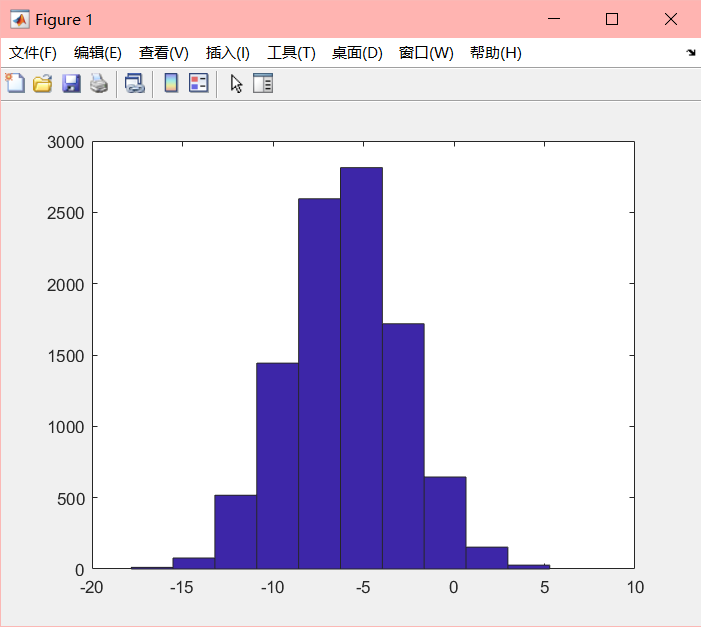

```matlab
>> eye(4)
ans =

     1     0     0     0
     0     1     0     0
     0     0     1     0
     0     0     0     1
```

`eye()`表示生成单位矩阵

### 移动数据

```matlab
>> A = [1 2; 3 4; 5 6];
>> size(A)
ans =
	3	2
>> v = [1 2 3 4]
>> length(v)
ans = 4	%将会返回最大维度的大小，一般用于求向量的大小，而不是用于矩阵
>> pwd
ans = D://.....	%显示当前路径
>> cd 'C:\Users'
```

载入文件：

```matlab
>> load xxxx.txt
>> load('xxxx.txt')
>> who	%可以显示出当前所有的变量
>> whos %可以显示出当前所有变量的详细信息
>> clear X	%删除X变量
>> clear	%删除所有变量
>> save xxx.mat V	%保存文件，把变量V存储为xxx.mat的文件
```

定位元素：

```matlab
>> A = [1 2; 3 4; 5 6];
>> A(3,2)
ans =	6
>> A(2,:)	%":"表示该行或列所有的元素
ans =
	3	4
>> A([1 3], :)	%获取第一行和第三行的所有元素
ans =
	1	2
	5	6
>> A = [A, [100;200;300]]	%可以在右边加一列新的矩阵
A =
     1     2   100
     3     4   200
     5     6   300
>> A(:)	%把A中的所有元素放到一列中
ans =
     1
     3
     5
     2
     4
     6
   100
   200
   300
```

### 计算数据

* 矩阵的乘法

  ```matlab
  >> A = [1 2; 3 4; 5 6];
  >> B = [11 12 13; 14 15 16];
  >> A*B
  ans =
  
      39    42    45
      89    96   103
     139   150   161
  ```

  上面的为矩阵的直接乘法，若要单独对元素进行操作则应该使用`.`

  ```matlab
  >> A = [1 2; 3 4; 5 6];
  >> B = [11 12; 13 14; 15 16];
  >> A.*B
  ans =
  
      11    24
      39    56
      75    96
  ```

  使用`.`可以对元素进行操作，不限于乘法。

* 计算绝对值：

  使用`abs()`命令可以求绝对值

* 矩阵转置：

  ```matlab
  >> A = [1 2; 3 4; 5 6]
  A =
       1     2
       3     4
       5     6
  >> A'
  ans =
       1     3     5
       2     4     6
  ```

  使用标准引号`'`可以求得矩阵的转置

* 逻辑比较：

  ```matlab
  >> a = [1 15 2 0.5];
  >> a < 3
  ans =
     1   0   1   1
  ```

  符合返回1，不符合返回0
  
* `magic()`函数

  `magic(n)`函数将会返回一个n阶的幻方矩阵，该矩阵的特点是每行每列以及对角线上的元素和都相等。

  ```matlab
  >> magic(3)
  ans =
       8     1     6
       3     5     7
       4     9     2
  ```
  
* `find()`函数

  ```matlab
  >> a = [1 15 2 0.5];
  >> find(a < 3 )
  ans =
       1     3     4
  ```

  将会返回符合条件的索引
  
  ```matlab
  >> A = magic(3)
  ans =
       8     1     6
       3     5     7
       4     9     2
  >> [r c] = find(A>=7)
  r =
       1
       3
       2
  c =
       1
       2
       3
  ```
  
  上述代码返回了符合条件的行和列的索引，比如`A(1,1)`大于等于7，`A(3,2)`也大于等于7。

* 求和：

  ```matlab
  >> a = [1 15 2 0.5];
  >> sum(a)
  ans =
     18.5000
  ```

  使用`sum()`函数可以求一个向量中的所有元素之和

  另外有：

  ```matlab
  >> A = magic(9)
  A =
      47    58    69    80     1    12    23    34    45
      57    68    79     9    11    22    33    44    46
      67    78     8    10    21    32    43    54    56
      77     7    18    20    31    42    53    55    66
       6    17    19    30    41    52    63    65    76
      16    27    29    40    51    62    64    75     5
      26    28    39    50    61    72    74     4    15
      36    38    49    60    71    73     3    14    25
      37    48    59    70    81     2    13    24    35
  >> sum(A,1)
  ans =
     369   369   369   369   369   369   369   369   369
  ```

  `sum(A,1)`返回了每列的求和，及把第1维度即每行的元素求和。同理`sum(A,1)`返回每列的求和，及把第2维度即每列的元素求和。

  另外注意，**如果不注明维度，则默认求第一维度即每列的和。**

  如何求对角线的和：

  我们先使用`A.*eye(9)`来使得除了对角线外的所有元素均为0

  ```matlab
  >> A = magic(9);
  >> A.*eye(9)
  ans =
      47     0     0     0     0     0     0     0     0
       0    68     0     0     0     0     0     0     0
       0     0     8     0     0     0     0     0     0
       0     0     0    20     0     0     0     0     0
       0     0     0     0    41     0     0     0     0
       0     0     0     0     0    62     0     0     0
       0     0     0     0     0     0    74     0     0
       0     0     0     0     0     0     0    14     0
       0     0     0     0     0     0     0     0    35
  ```

  接下来只需求这个矩阵的所有元素之和：

  ```matlab
  >> sum(A.*eye(9), 'all')
  ans =
     369
  ```

  我们还可以使用`flipud()`命令来使单位矩阵垂直翻转来求另一条对角线的和：

  ```matlab
  >> A = magic(9);
  >> A.*flipud(eye(9))
  ans =
       0     0     0     0     0     0     0     0    45
       0     0     0     0     0     0     0    44     0
       0     0     0     0     0     0    43     0     0
       0     0     0     0     0    42     0     0     0
       0     0     0     0    41     0     0     0     0
       0     0     0    40     0     0     0     0     0
       0     0    39     0     0     0     0     0     0
       0    38     0     0     0     0     0     0     0
      37     0     0     0     0     0     0     0     0
  >> sum(A.*flipud(eye(9)), 'all')
  ans =
     369
  ```

  

  

* 求积：

  ```matlab
  >> a = [1 15 2 0.5];
  >> prod(a)
  ans =
  	15
  ```

* 取整：

  `floor()`函数可以对数字进行向下取整，`ceil()`函数可以对数字进行向上取整。

* `max()`函数

  * 对向量:

    ```matlab
    >> a = [1 15 2 0.5];
    >> max(a)
    ans = 
  	  15
    ```
    上述例子的`max()`函数返回了一个向量之中的最大值，如果要获取它的索引则有：

    ```matlab
    >> a = [1 15 2 0.5];
    >> [val, ind] = max(a)
    val =
        15
    ind =
         2
    ```
    其中`val`返回了最大元素的值，`ind`返回了其索引
    
  * 对矩阵：

    ```matlab
    >> A = magic(3)
    ans =
         8     1     6
         3     5     7
         4     9     2
    >> max(A,[],1)
    ans =
         8     9     7
    ```
  
    上面的结果返回了每列元素的最大值，后面的1表示对第一维度进行遍历，从第1行到第n行进行比较，返回最大值，从而求出每列最大的元素，同理有`max(A, [], 2)`来求得每行元素的最大值。
  
    当然要记得，**如果对一个矩阵进行如同`max(A)`一般的操作，则默认返回以第一维度求和即每列的最大值。**
  
    如果你想求得一个矩阵中最大的元素，则可以用以下方法：
  
    ```matlab
    >> max(max(A));
    >> max(A, [], 'all');
    ```
  
* 求逆矩阵：
  
  ```matlab
  >> pinv(A)
  ```
  
  使用`pinv()`来求矩阵的逆矩阵
  
### 数据绘制

```matlab
>> t=[0:0.01:1];
>> y1=sin(2*pi*4*t);
>> plot(t,y1)
```

上述命令可以简单的绘制出一个正弦函数：

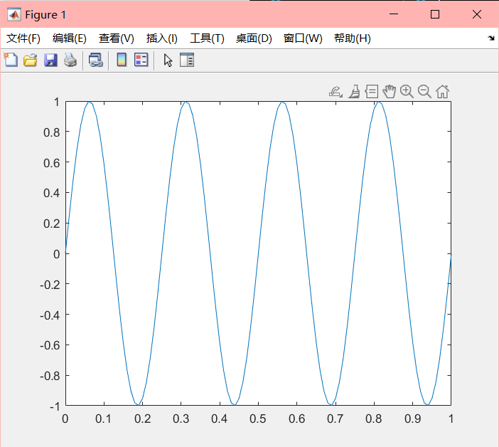

我们接着输入：

```matlab
>> y2=cos(2*pi*4*t)
>> plot(t,y2);
```

这时你会发现，matlab抹除了之前绘制的sin函数，再绘制出了cos函数，要想把两个曲线绘制到同一个图上，我们可以这样做：

```matlab
>> plot(t,y1);
>> hold on;
>> plot(t,y2,'r');	%将曲线颜色设置为红色
```

`hold on`可以保留之前绘制的内容然后接着绘制新的内容：

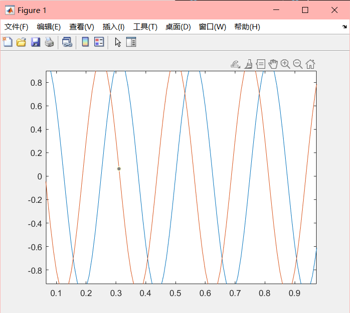

我们还可以在图上添加其他的数据：

```matlab
>> xlabel('time')	%给x轴加上标签
>> ylabel('value')	%给y轴加上标签
>> legend('sin','cos')	%在图上标明曲线的名字
>> title('my plot')	%给图取名字
```

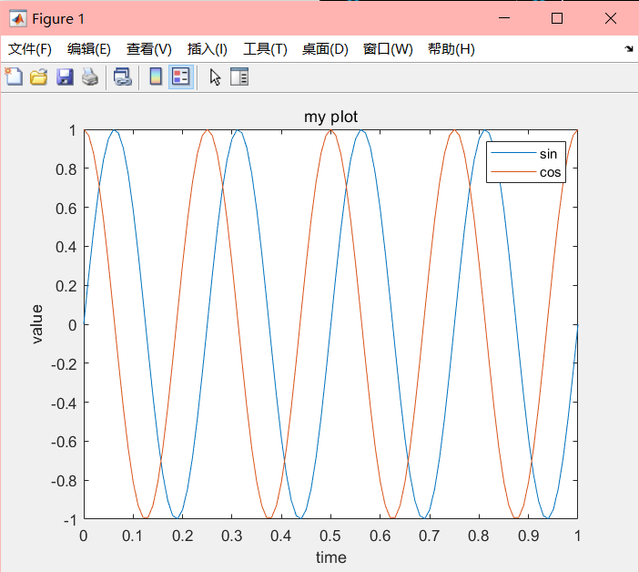

保存图像：

```matlab
>> print -dpng 'my Plot.png'
```

这会在当前路径保存图片，另外`close`可以把图像关闭

在两张图上绘制：

```matlab
>> figure(1);
>> plot(t,y1);
>> figure(2);
>> plot(t,y2);
```

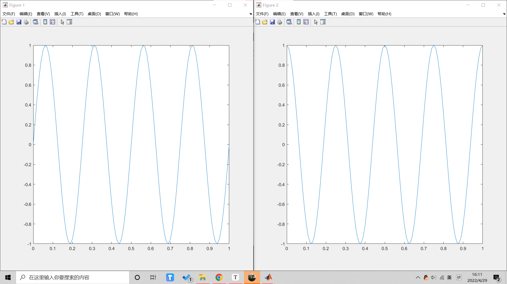

这样我们就得到了两个图

在一个图里画多个独立的曲线：

```matlab
>> subplot(1,2,1);	%这个语句前两个参数表示把图分为1*2的格子，最后一个参数表示使用第一个格子
>> plot(t,y1);
```

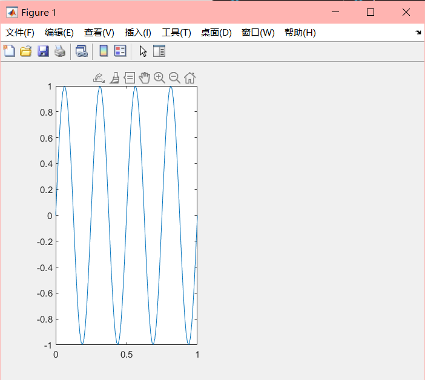

```matlab
>> subplot(1,2,2);
>> plot(t,y2);
```

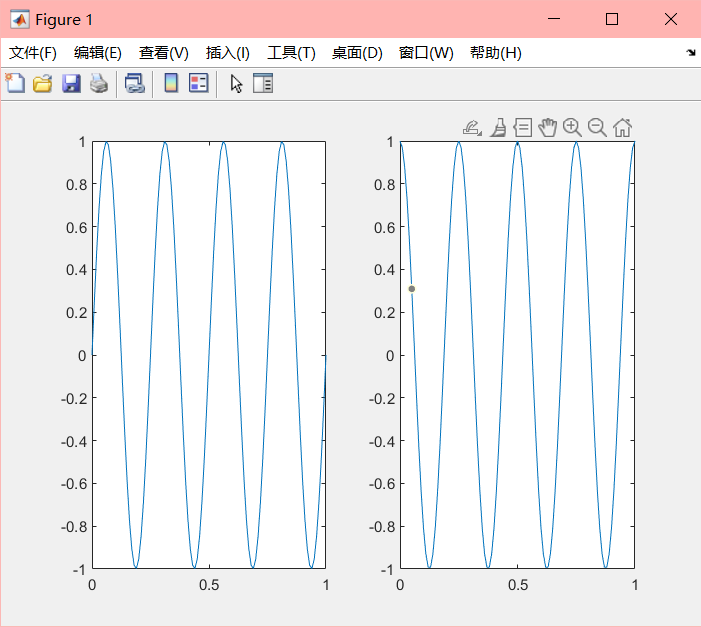

调整轴的范围：

```matlab
>> axis([0.5 1 -1 1])	%前两个调整x轴的范围，后两个调整y轴的范围
```

可视化矩阵：

```matlab
>> A = magic(5)
>> imagesc(A)
```

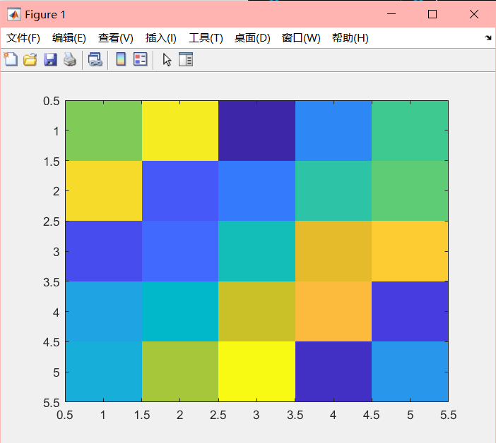

`colorbar`可以在旁边加一个颜色对照表：

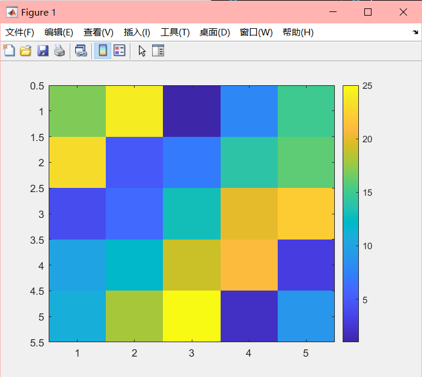

## $logistic$回归

一般用于分类问题

### 分类

#### 二分类

此类分类只有两类，换言之该分类只有两种状态。

### 假设陈述

因为在分类问题中，尤其是在二分类中，状态通常只有0和1两种，但是在线性回归中，$h_\theta(x)$会出现大于1的情况，所以通常不适合于分类问题，所以现在需要一种新的概述，使$h_\theta(x)$处于0到1之间。

在线性回归中我们的$h_\theta(x)$为：
$$
h_\theta(x)=\theta^Tx
$$
在$logistic$回归中，我们对$h_\theta(x)$做出改进，令$h_\theta(x)=g(\theta^Tx)$，其中：
$$
g(x)={1\over1+e^{-x}}
$$
我们将两个方程结合起来，就得到了新的$h_\theta(x)$：
$$
g(x)={1\over1+e^{-\theta^Tx}}
$$
这个函数一般被称为$sigmoid$函数，其图形为：

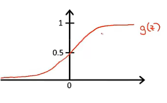

有了这个假设，我们只需要一组$\theta$来拟合我们的数据。

#### 模型的解释：

$h_\theta(x)$估计了输入$x$时$y=1$的概率


### 决策界限

$sigmoid$函数已经决定了输入$x$时$y=1$的概率，当$x$大于$0$的时候$h_\theta(x)$大于0.5，表示$y=1$，反之则为$y=0$。

现在问题就转换为拟合$\theta^T$使在$X$时的$\theta^{T}X$大于$0$，如下图。


图中的点集为数据集，一共有两个特征变量，得出$h_\theta(x)=g(\theta_0+\theta_1x_1+\theta_2x_2)$

假设我们已经通过方法把$\theta$都拟合出了，得出$h_\theta(x)=g(-3+x_1+x_2)$

当我们预测$y=1$时，使$-3+x_1+x_2>0$，根据我们高中学过的线性回归，我们就可以在图上画出一条直线，在直线之上的点都表示$y=1$，这条线就被称为决策界限。

### 代价函数

在上面的问题中我们谈到了决策界限的定义，但是决策界限是基于已经拟合出来的$\theta$来决定了，现在我们的问题来到了如何拟合$\theta$，要拟合$\theta$首先需要把代价函数求出来。

在线性回归中我们的代价函数为：
$$
J(\theta )=\frac{1}{m}\sum_{i=1}^{m}\frac{1}{2}(h_\theta(x^{(i)})-y^{(i)})^2   
$$
但是在$logistic$回归中，因为$h_\theta(x)$的不同，$J(\theta)$为非凸函数，存在多个局部最优解，不可以使用梯度下降法拟合，因此我们将$J(\theta)$设为：
$$
J(\theta)=\frac{1}{m}\sum_{i=1}^{m}Cost(h_\theta(x),y)
$$
其中：
$$
Cost(h_\theta(x),y)=\begin{cases}
-log(h_\theta(x))&if&y=1\\
-log(1-h_\theta(x))&if&y=0
\end{cases}
$$
当$y=1$时：

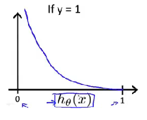

代价函数如图所示，当估计的$h_\theta(x)$为1时，实际上的$y$也为$1$，可以很好的拟合，因此我们的代价在图中为0；

当$h_\theta(x)$估计为0时，实际上为$y=1$，与实际不符，所以图中的代价为$\infty$

反之在下图$y=0$时也成立

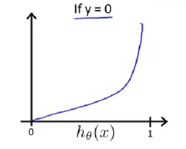

### 简化代价函数以及梯度下降

在上面我们得出了$logistic$回归的代价函数，我们现在可以来将它化简为：
$$
Cost(h_\theta(x),y)=-ylog(h_\theta(x))-(1-y)log(1-h_\theta(x))
$$
此式也可以表示为$logistic$回归的代价函数

现在有：
$$
J(\theta)=-\frac{1}{m}[\sum_{i=1}^{m}ylog(h_\theta(x))+(1-y)log(1-h_\theta(x))]
$$
To fit parameters $\theta$:

We need to minimize $J(\theta)$

We use Gradient Descent to minimize $J(\theta)$
$$
\theta_j:=\theta_j-\alpha\frac{\partial}{\partial\theta_j}J(\theta)\\
$$
重复上式，其中
$$
\frac{\partial}{\partial\theta_j}J(\theta)=\frac{1}{m}\sum_{i=1}^{m}(h_\theta(x^{(i)})-y^{(i)})x_j^{(i)}
$$


### 高级优化

我们可以使用matlab中自带的一些优化算法来拟合出$J(\theta)$的$\theta$，下面举个例子：

Example：
$$
\theta=\begin{bmatrix}
 \theta_1\\
\theta_2
\end{bmatrix}\\
J(\theta)=(\theta_1-5)^2+(\theta_2-5)^2\\
\frac{\partial}{\partial\theta_1}J(\theta)=2(\theta_1-5)\\
\frac{\partial}{\partial\theta_2}J(\theta)=2(\theta_2-5)
$$
在matlab中我们可以写这样一个函数：

```matlab
function [jVal, gradient]
			= costFunction(theta)
	jVal = (theta(1)-5)^2 + (theta(2)-5)^2;	//为代价函数
	gradient = zeros(2,1);					//梯度值
	gradient = 2*(theta(1)-5);
	gradient = 2*(theta(2)-5);
```

然后在终端中输入：

```matlab
option = optimset('GradObj', 'on', 'MaxIter', '100');	//优化设置
initialTheta = zeros(2,1);								//初始化theta
[optTheta, functionVal, exitFlag]
	= fminunc(@costFunction, initialTheta, option);
```


### 多元分类问题

我们现在要分多个类别，比如分类邮件为亲人、同事、广告三个，这就涉及到多元分类问题。

我们将上面的类别分别设为1、2、3，多个类别时我们的点集可能如下：

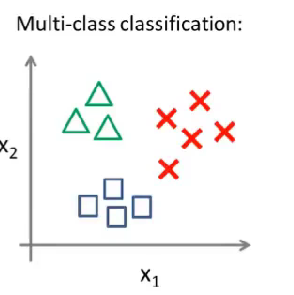

我们可以将2、3看为负类，将1看为正类，得到y=1时的$h_\theta^{(1)}(x)$

这样我们就可以得到三个分类器，对应三个不同的类别，这样就实现了多元分类问题。

## 过拟合问题

### 过拟合

过拟合($overfitting$)：也称为过学习，他的直观表现是在学习出的模型在训练集上表现良好，但在实际问题出表现不好，泛化性差。


上图表现出的算法在以给定的训练集上表现良好，但是在实际问题中不能很好的应用，泛化性差，这种问题我们称之为过拟合(通过样本点且波动程度太大)。

一般过拟合会在变量过多的时候出现。

### 如何解决过拟合

1. 尽量减少所选的变量的数量。（缺点是可能舍去与预测有关的变量）
2. 正则化：保持变量数量不变，把$\theta_j$减小。


### 变化代价函数

减小$\theta_j$意味着得到的模型更简单，泛化性更强。

所以在代价函数后面加上以下公式即可减小$\theta_j$
$$
J(\theta)=\frac{1}{2m}[\sum_{i=1}^{m}(h_\theta(x^{(i)})-y^{(i)})^2+\lambda\sum_{i=1}^{m}\theta_j^2]
$$
其中$\lambda$为正则化系数，负责控制$\theta$的变化大小。


### 线性回归的正则化

上面我们提到正则化就是修改**代价函数**使之对$\theta_j$进行减小以是模型更为简单。修改之后的代价函数为：
$$
J(\theta)=\frac{1}{2m}[\sum_{i=1}^{m}(h_\theta(x^{(i)})-y^{(i)})^2+\lambda\sum_{i=1}^{m}\theta_j^2]
$$


下面是线性回归的正则化

重复：
$$
\theta_0:=\theta_0-\alpha\frac{1}{m}\sum_{i=1}^{m}(h_\theta(x^{(i)})-y^{(i)})x_0^{(i)}\\
\theta_j:=\theta_j-\alpha[\frac{1}{m}\sum_{i=1}^{m}(h_\theta(x^{(i)})-y^{(i)})x_j^{(i)}+\frac{\lambda}{m}\theta_j]
$$
其中对$\theta_0$不进行修改是约定俗成的规矩，对$\theta_0$是否进行正则化对结果的影响不是很大。其中上面对$\theta_j$的梯度下降可写为：
$$
\theta_j:=\theta_j(1-\alpha\frac{\lambda}{m})-\alpha\frac{1}{m}\sum_{i=1}^{m}(h_\theta(x^{(i)})-y^{(i)})x_j^{(i)}
$$


其中$(1-\alpha\frac{\lambda}{m})$是一个非常接近但小于1的数字。

正规方程的正则化：
$$
\theta=(X^TX+\lambda
\begin{bmatrix}
{0}&&&\\
&{1}&&\\
&&{1}&\\
&&&{1}\\
&&&&{\ddots}\\
&&&&&{1}
\end{bmatrix})^{-1}X^Ty
$$


$logistic$的正则化
$$
J(\theta)=[-\frac{1}{m}y^{(i)}log(h_\theta(x^{(i)}))+(1-y^{(i)})log(1-h_\theta(x^{(i)}))]+\frac{\lambda}{2m}\sum_{j=1}^{n}\theta_j^2
$$


重复：
$$
\theta_0:=\theta_0-\alpha\frac{1}{m}\sum_{i=1}^{m}(h_\theta(x^{(i)})-y^{(i)})x_0^{(i)}\\\theta_j:=\theta_j-\alpha[\frac{1}{m}\sum_{i=1}^{m}(h_\theta(x^{(i)})-y^{(i)})x_j^{(i)}+\frac{\lambda}{m}\theta_j]
$$

## 神经网络

### 背景

人们想要创造出一种可以模仿人类大脑结构的算法。

### 大脑中的神经元

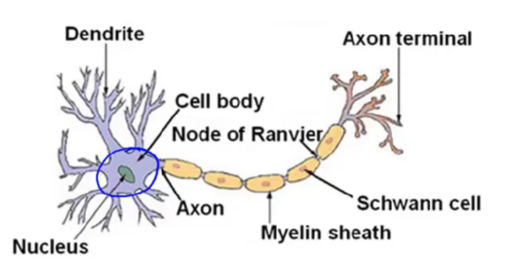

胞体负责接受信号，轴突负责发送信号。

### 神经元模型：Logistic unit

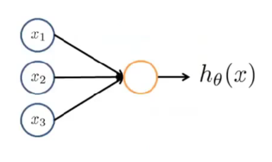

上面为神经网络的一个神经元，相当于神经元接受一些输入，经过处理后再输出计算的结果$h_\theta(x)$，其中$h_\theta(x)$为$\frac{1}{1+e^{-\theta^Tx}}$

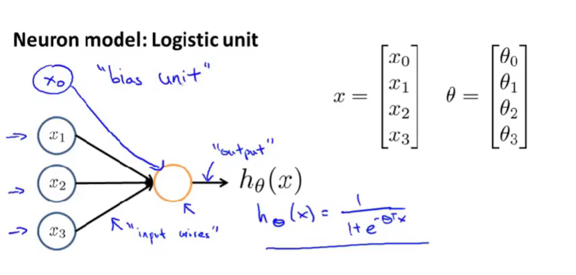

一般来说可以将$x_1,x_2,x_3$作为输入数据，我们通常会添加一个$x_0=1$作为偏置单元同样作为输入

刚才描述了一个以$sigmoid$函数作为激活函数($activation function$)的人工神经元，代表一个神经元，神经网络实际上就是很多个神经元组合起来的模型：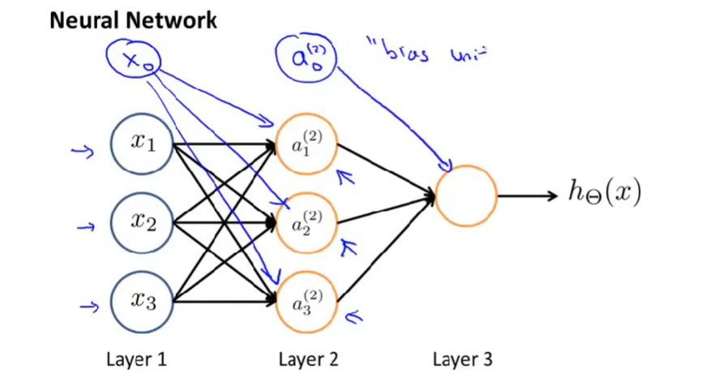

第一层称为输入层，最后一层输出层，其他层都称为隐藏层。

上图中的$a_1^{(2)}$表示第2层的第一个激活项(activation)

$\Theta^{j}$表示控制第j层到j+1层的映射的权重矩阵，比如第1层经过$\Theta^1$的处理后才变成了第2层的数据。


这边是具体的权重矩阵与激活项的计算细节。

我们定义上面的$\Theta^{(1)}_{10}x_0+\Theta^{(1)}_{11}x_1+\Theta^{(1)}_{12}x_2+\Theta^{(1)}_{13}x_3=z^{(2)}_1$

即有：
$$
a^{(2)}_1=g(z^{(2)}_1)
$$

$$
x=\begin{bmatrix}
x_0\\
x_1\\
x_2\\
x_3
\end{bmatrix}
&&&&z^{(2)}=\begin{bmatrix}
z^{(2)}_1\\
z^{(2)}_2\\
z^{(2)}_3
\end{bmatrix}
$$

$$
z^{(2)}=\Theta^{(1)}x
$$

### 举例

假设我们有两个输入值：

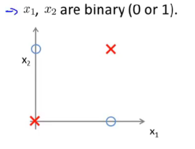

表示只有当$x_1,x_2$都为1或0时结果为假，现在我们需要一个模型来学习它。

我们先介绍逻辑**与**的神经网络结构：

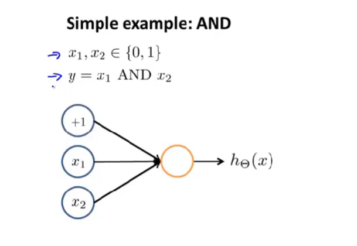

上图中的$+1$为偏置单元，我们得到的$\Theta$为：-30，20，20，这样就有了
$$
h_\Theta(x)=g(-30+20x_1+20x_2)
$$
这样就简单表示了**与**运算。可以自己画一个真值表来验证。

我们再来接受逻辑**或**的神经网络结构：

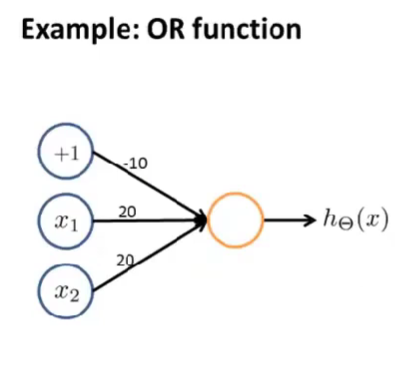

得到的$\Theta$为-10，20，20

逻辑**非**的结构;

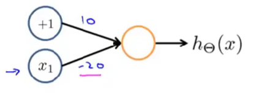

现在我们把这三个结构结合起来：

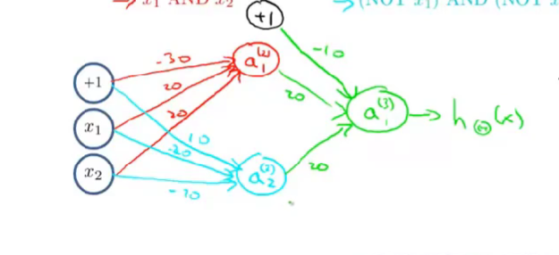

其中红色的节点表示$x_1,x_2$都为1时，蓝色表示$x_1,x_2$都为0时，绿色的OR运算表示红色和蓝色成立一种时就输入肯定答案。

这样神经网络的作用就体现出来了，神经网络可以将复杂的算法简单化，把复杂的算法在每一层用简单的算法表示出来。

### 多分类问题

对于多分类问题，我们可以让$h_\theta(x)$的输出为矩阵。比如$\begin{bmatrix}1\\0\\0\end{bmatrix}$表示第一种结果，$\begin{bmatrix}0\\1\\0\end{bmatrix}$表示第二种结果，$\begin{bmatrix}0\\0\\1\end{bmatrix}$表示第三种结果。

### 代价函数

定义：

$L$为神经网络的层数

$s_l$为第l层神经网络的结点数量，特别定义$K$为输出层的结点数量

**神经网络的代价函数**：
$$
J(\Theta)=-\frac{1}{m}[\sum_{i=1}^{m}\sum_{k=1}^{K}y_k^{(i)}log(h_\Theta(x^{(i)}))_k+(1-y_k^{(i)})log(1-(h_\Theta(x^{(i)}))_k)]+\frac{\lambda}{2m}\sum_{l=1}^{L-1}\sum_{i=1}^{s_l}\sum_{j=1}^{s_{l+1}}(\Theta_{ji}^{(l)})^2
$$
前面的$k$的和表示多分类时，多个输出结点的输出结果之和，当$K=1$时可忽略。

后半项的作用为正则化，其中不正则化下标为$0$的$\Theta$，这点于$logistic$回归一致。

### **反向传播算法**

回顾我们的神经网络的代价函数，我们的目标是最小化$J(\Theta)$，我们需要计算：

* $J(\Theta)$
* $\frac{\partial}{\partial\Theta_{ij}^{(l)}}J(\Theta)$

我们定义：$\delta_j^{(l)}$表示第$l$层第$j$个结点的误差。

举个例子(layer L = 4)：

$\delta^{(4)}=a^{(4)}-y$

$\delta^{(3)}=(\Theta^{(3)})^T\delta^{(4)}·*g'(z^{(3)})$

$\delta^{(2)}=(\Theta^{(2)})^T\delta^{(3)}·*g'(z^{(2)})$

其中$g'(z)=a·*(1-a)$，计算的时候只需修改上标即可，比如$g'(z^{(2)})=a^{(2)}·*(1-a^{(2)})$

如果我们不考虑正则化的话，可以证明：
$$
\frac{\partial}{\partial\Theta_{ij}^{(l)}}J(\Theta)=a_j^{(l)}\delta_i^{(l+1)}
$$
算法步骤：

对于$m$个训练集

初始化$\triangle_{ij}^{(l)}=0$

对每个训练集$i=1$ to $m$：

​	set $a^{(1)}=x^{(i)}$

​	正向传播计算出每一层的值

​	使用$y^{(i)}$来计算$\delta^{(L)}=a^{(L)}-y^{(i)}$

​	反向传播计算出每一个$\delta$

​	累加：$\triangle_{ij}^{(l)}:=\triangle_{ij}^{(l)}+a_j^{(l)}\delta_{i}^{(l+1)}$

$D_{ij}^{(l)}:=\frac{1}{m}\triangle_{ij}^{(l)}+\lambda\Theta_{ij}^{(l)}\quad if \quad j\neq0$

$D_{ij}^{(l)}:=\frac{1}{m}\triangle_{ij}^{(l)}\quad if \quad j=0$

可以证明：
$$
\frac{\partial}{\partial\Theta_{ij}^{(l)}}J(\Theta)=D_{ij}^{(l)}
$$

### 理解反向传播

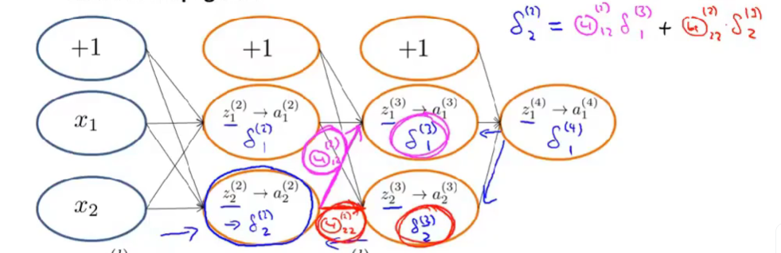

### 小细节：展开参数（矩阵到向量）

在我们求$minJ(\Theta)$的过程中，我们通常会用到matlab中更为高级的优化算法，但是在算法的接口中我们只有一个$\Theta$参数的传入，神经网络中我们却有多个$\Theta^{(l)}$，因此我们需要将这些$\Theta$展开为一个向量传入算法中。

举个例子：

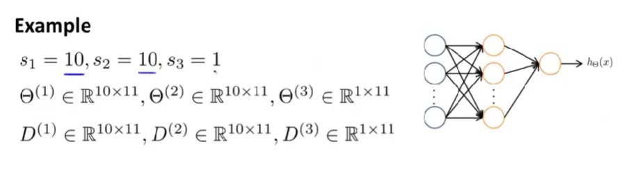

把矩阵展开为一个向量：

```matlab
thetaVec = [ Theta1(:); Theta2(:); Theta3(:) ];
DVec = [D1(:); D2(:); D3(:)];
```

恢复向量到矩阵：

```matlab
Theta1 = reshape(thetaVec(1:110),10,11);
Theta2 = reshape(thetaVec(111:220),10,11);
Theta3 = reshape(thetaVec(221:231),1,11);
```

### 梯度检测

反向传播的实现中，经常会出现一些bug，因此我们需要一种检验方式来检测反向传播是否正常运作。

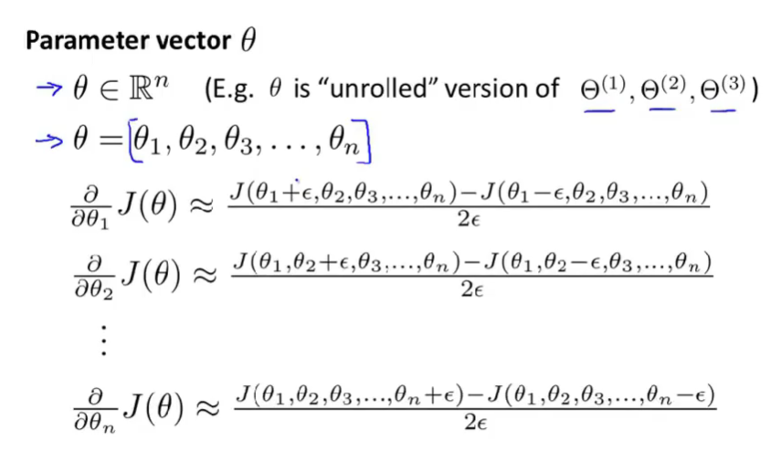

我们使用偏导数的定义来求取梯度，与反向传播的对比，如果一致则继续使用反向传播，**记住一定要取消梯度检测的代码，梯度检测的时间复杂度远高于反向传播。**

### 随机初始化

在前面的线性回归和逻辑回归中，我们通常为$\Theta$取初始值为0，但是在反向传播中，我们不能将值取为0。

在反向传播中，$\Theta$表示权重，在反向传播的过程中，如果所有的权重一致，则结点的计算值就会一致，会造成大量的冗余。

因此我们需要使用随机数来初始化$\Theta$：

```matlab
Theta1 = rand(10,11)*(2*INIT_EPSILON) - INIT_EPSiLON;
```

这样会使$\Theta$的值处于$[-\epsilon,+\epsilon]$之间

### 总结

#### 选择神经网络结构

输入层：数量为特征的种类数

输出层：分类数

较为理想的结构：1层隐藏层，如果大于一层，最好隐藏层的结点数都相等。（一般来说层数越多越好，但是学习所耗费的时间更多）

#### 训练神经网络

1. 随机初始化权重
2. 正向传播计算出每个结点的值
3. 计算$J(\Theta)$
4. 反向传播计算梯度
5. 使用梯度检测来检测反向传播是否正确
6. 使用高级优化算法最小化$J(\Theta)$

## 一些建议

我们在设计机器学习模型的过程中，会遇到许多问题，比如训练集的大小的选择，特征数量的选择，模型多项式的选择，正则化参数$\lambda$的大小选择等，下面介绍如何解决上面的问题，以及遇到什么情况了我们该增大或减小哪个参数的问题

### 评估模型

在我们训练模型的过程中，我们通常会遇到过拟合的问题，为了判断一个模型的泛化性，我们将数据集按$7:3$分割，其中$70\%$用于训练模型，剩下的用于测试模型的泛化性。

比如在线性回归中，我们用$70\%$的训练集拟合出了$\theta$，然后将$\theta$带入$J(\theta)$，且使用测试集中的数据来计算出误差，以此来评估模型

### 模型的选择

在我们选择一个模型时，我们需要选择多项式的次数，假设次数为$d$，我们需要选择$d$。

我们现在把训练集分为三个部分，第一部分为训练集，第二部分为交叉验证($cross$ $validation$)集，第三部分为测试集，分配比例为$6:2:2$。

接下来我们对每一次方的模型都拟合出一个$\theta$出来，然后用验证集来计算出代价函数，选择出最小的值对应的次方。

### 偏差与方差

在我们选择模型之后，我们可能仍然不能很好的拟合出正确的模型，我们的代价函数依然很大，这时我们需要判断此时的模型状态是方差问题还是偏差问题。

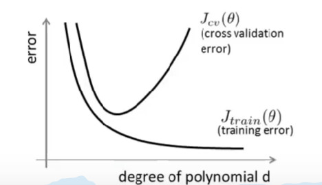

如图，在我们的多项式次数较低的时候，我们的模型会出现欠拟合，这时无论对训练集的代价函数还是验证集的代价函数，对应的误差都比较高，**这时我们认为这是我们对模型的偏差较大**；当多项式次数较高的时候，我们的模型出现过拟合，这时我们的训练集能很好的满足模型的预测，但是验证集的代价函数的值还是较高，**这时我们认为模型的方差较大**，此时验证集的代价函数远大于训练集的代价函数。

### 正则化与方差、偏差

在我们防止过拟合的过程中，我们会在代价函数后面添加一个正则化项。

当我们的正则化参数$\lambda$较大时：

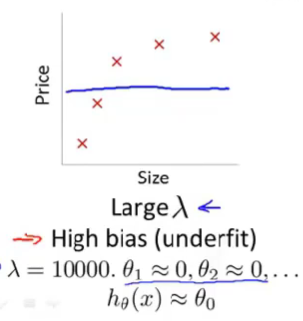

会出现欠拟合的情况，较大的$\lambda$会对$\theta$造成过大的惩罚，使其值接近于零。

当$\lambda$较小时：

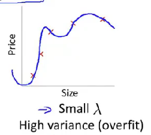

会出现过拟合的情况，较小的$\lambda$会对$\theta$几乎没有惩罚，相当于没有进行正则化。


我们定义训练集、验证集、测试集的代价函数都不带有正则化项。

在选择正则化参数时，尝试从$\lambda=0,\ \lambda=0.01,\ \lambda = 0.02,\ \lambda = 0.04,\ ......,\ \lambda=10.24$一一训练模型，在$\lambda=0$时使用带有正则化的代价函数拟合出$\theta$再带入到验证集中计算出验证集的代价函数值，以此类推。最后得到最小的验证集代价函数对应的正则化参数。

下面用图来表示$\lambda$对代价函数的影响：

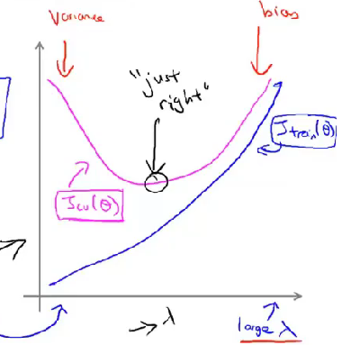

### 学习曲线

学习曲线是一个可以很好判断假设模型是否处于方差或偏差问题之中的工具。

当模型刚好时的学习曲线：

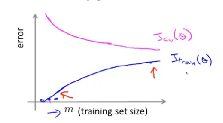

高偏差时的学习曲线：

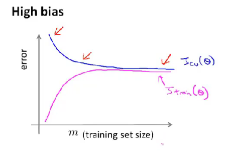

当处于高偏差的状态时，使用更多的数据集往往不能帮助我们改进模型，因为多项式的阶数太低，无论有多少数据集都会发生欠拟合问题。

高方差时的学习曲线：

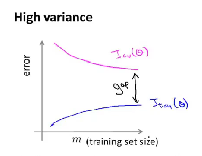

高方差时，当我们增加数据集时，我们的验证集的误差值会下降，所以对于高方差问题，增加训练集数量往往会有帮助。

### 总结

使用更多的训练集——高方差问题

减少特征的数量——高方差问题

增加特征的数量——高偏差问题

增加高阶特征——高偏差问题

减少$\lambda$——高偏差问题

增加$\lambda$——高方差问题

## 确定执行的优先级

在优化一个学习算法时，我们通常有多种思想来改进算法，但是哪种方法是最优的却需要一种标准来评判。

### 误差分析

在判断优化方法时，我们最常用的方式是先计算出没有使用该优化方式的错误率，再计算出使用了该方式的算法错误率，通过比较两者，从而达到了选择优化策略的目的。

### 不对称性的误差分析

我们上面的算法误差分析是通过错误率(正确率)来判断误差的，但是对于偏斜类问题，单独使用正确率来判断往往是不准确的。

#### 偏斜问题

在癌症预测的问题中，我们使用肿瘤的大小来判断是否罹患癌症，假设我们设计的算法的准确率达到了$99\%$，这似乎听起来是一个很好的模型，准确率很高，但是数据集中罹患癌症的数量只占据的$0.5\%$，这意味着如果我们不使用机器学习算法，只单纯的认为所有人都没有得癌症，那么我们算法的准确率在$0.5\%$，这似乎还要优于我们的机器学习算法，但是现实经验告诉我们这实际上不是一个高性能的算法，像这类数据集比例极不均衡(患有癌症的人数远远小于健康的人)的问题被称为偏斜问题。

#### 精准度/召回率

为了解决偏斜问题，我们提出了精准度和召回率两个概念来共同评估算法的优劣。

在癌症预测问题中，我们定义$2\times2$表格：

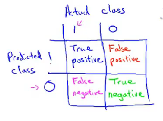

其中左上表示我们预测为真且实际真为患者的数量，称为真阳性。

右下表示我们预测为健康且实际真为健康的数量，称为真阴性。

右上表示我们预测为患者但是实际为健康的数量，称为假阳性。

左下表示我们预测为健康但是实际为患者的数量，称为假阴性。

我们定义**准确率**(precision)：
$$
\frac{真阳性的数量}{算法预测的阳性的数量}
$$
定义**召回率**(recall):
$$
\frac{真阳性的数量}{样本中所有阳性的数量}
$$
在我们上面认为所有患者均为健康的算法中，召回率显然为$0$，因此说明这不是一个很好的算法。

如果一个算法有着较高的准确率以及较高的召回率，我们就可以认为这是一个比较良好的算法。

### 精准度和召回率的权衡

在我们的癌症预测问题中，我们使用了逻辑回归，判断癌症的临界值设为$h_\theta(x)>0.5$，但是鉴于判断癌症是一个较为严肃的问题，基于现实经验，一旦下结论就可能对患者的心理造成冲击，因此我们采用一个比较高的临界值来判断：$h_\theta(X)>0.7$

我们使用了较大的临界值会使我们的预测更谨慎，我们的准确率会上升，但是我们的召回率会下降。

鉴于如果罹患癌症却被诊断为健康导致没有得到及时治疗从而死亡的后果较为严重，我们需要降低临界值，从而提高了召回率，但是我们的准确率下降了，因为随着判断的阳性数量变多肯定会有更多的人是健康的。


上面的问题说明了我们在召回率和准确率之间是需要一个权衡的，而不是像单纯的误差分析那样只通过数值来判断。因此我们引入$F_1值$：
$$
F_1=2\times\frac{precision\times recall}{precision+recall}
$$
我们在实际中通常对一系列临界值进行训练再计算出$F_1$，通过判断$F_1$的大小可以很好的得出临界值的选择。

### 机器学习的数据

在机器学习中，往往更多的数据可以带来性能更好的算法。

一个良好的算法通常有很多高阶特征同时又有极大的数据来进行训练从而防止过拟合的问题。


## 支持向量机

### 优化目标

回忆我们之前学习的逻辑回归，我们的$h_\theta(x)$为：
$$
h_\theta(x)=\frac{1}{1+e^{-\theta^Tx}}
$$
如果$y=1$，我们希望预测的值接近于$1$，从$sigmoid$函数图像来看，这要求$\theta^Tx$远远大于$0$。

再去看逻辑回归的代价函数，每一个样本对代价函数的代价如图：

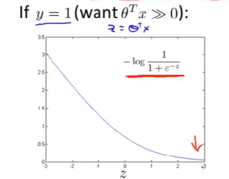

为了构建支持向量机，我们对上述图像做出一点修改：

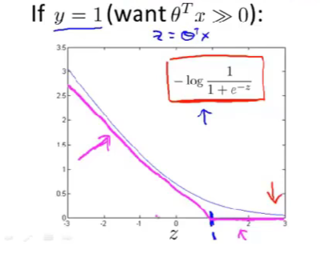

让代价函数在$z>1$的地方等于$0$，在$z<1$的地方近似地描绘出一条和逻辑回归曲线相似的直线。我们称这个代价函数为$cost_1(z)$

同理，有：

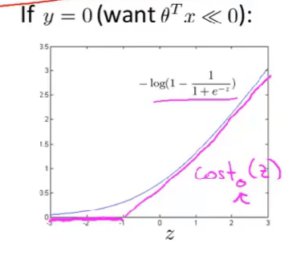

经过修改之后的支持向量机的优化目标为：
$$
\min_\theta C\sum_{i=1}^{m}[y^{(i)}cost_1(\theta^Tx^{(i)})+(1-y^{(i)})cost_0(\theta^Tx^{(i)})]+\frac{1}{2}\sum_{j=1}^n\theta^2_j
$$
上述的$C$与逻辑回归中的正则化的$\lambda$一样，用于控制前后的权重以此来控制算法的方差与偏差。

最后，与逻辑回归不同的是，SVM不会输出概率，会直接输出结果，如果$\theta^Tx>0$则直接输出$1$。

### 直观上对大间隔的理解

SVM的决策边界如图：

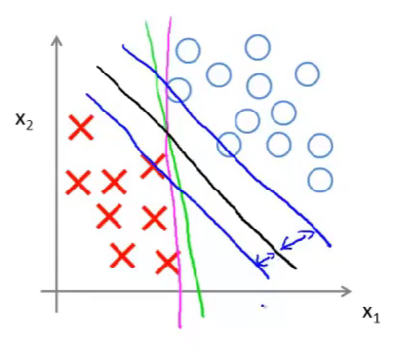

图中黑色的线为其决策边界，其与其他样本的最小距离更大一些，具有更好的鲁棒性。

### 大间隔的数学原理

以有两个特征量的模型举例，我们的优化目标为：
$$
\min_\theta \frac{1}{2}\sum_{j=1}^n\theta^2_j 
$$
与之前讲的优化目标不一样的是前面的式子消失了，这是因为我们将$C$设置的非常大，当$\theta^Tx>1$时$cost(\theta^Tx)$即为零，所以只剩下了后一项。根据我们高中的知识，上述的式子又可以化为：
$$
\min_\theta \frac{1}{2}\Vert\theta\Vert^2
$$
上述表示$\theta$向量的模的平方。

在我们优化的过程中，我们需要使$\theta^Tx>1\\\theta^T x<-1$，这也可以化简为$p^{(i)}\cdot\Vert\theta\Vert>1\\p^{(i)}\cdot\Vert\theta\Vert<-1\\$，其中$p^{(i)}$表示$x^{(i)}$在$\theta$上的投影。

分析上式，我们的目标是最小化$\Vert\theta\Vert$同时使$p^{(i)}\cdot\Vert\theta\Vert>1\\p^{(i)}\cdot\Vert\theta\Vert<-1\\$，因此当$\vert p^{(i)}\vert$越大，对$\theta$要求越小。

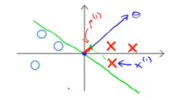

上图中的绿色为决策边界，$\theta$与其正交(因为$\theta^T*x=0$)，从其样本点在$\theta$上的投影为红色区域，显然比较小，因此不能得到一个很好的优化效果。

同理：

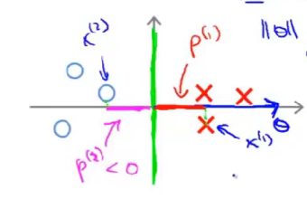

上述的图像可以使投影长度最大，从而达到最小$\Vert\theta\Vert$，绿线为决策边界，拥有着较大的间隔。


### 核函数

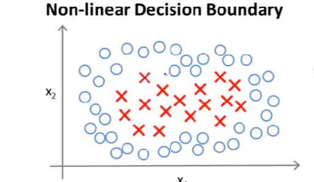

在上面非线性模型中，我们想要拟合它的边界曲线，我们一般是使用高阶多项式来拟合这个模型，不过使用高阶多项式的问题也显而易见，我们并不知道什么样的高阶多项式是对我们的算法是有效的，高级多项式的选择成为了一个问题，而核函数的出现则代替的高阶多项式来表示模型。

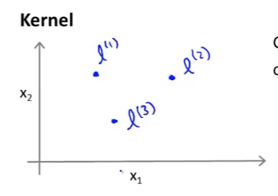

在给定的样本空间内，我们手动选择了三个点，同时我们定义：
$$
f_1 = similarity(x,l^{(1)})=exp(-\frac{\Vert x-l^{(1)}\Vert}{2\sigma^2})\\
f_2 = similarity(x,l^{(2)})=exp(-\frac{\Vert x-l^{(2)}\Vert}{2\sigma^2})\\
f_3 = similarity(x,l^{(3)})=exp(-\frac{\Vert x-l^{(3)}\Vert}{2\sigma^2})
$$
上述函数称为相似度函数，后面的一项为高斯核函数，我们也有其他的相似度核函数，只不过在这里我们使用的是高斯核函数。

#### 核函数的作用：

让我们分析上述的核函数，当我们选择的样本点$x$接近于$l^{(1)}$点时，两点之间的距离近似于$0$，则指数项接近于$0$，因此$f_1=1$，当$x$远离$l^{(1)}$点时，$f_1=0$

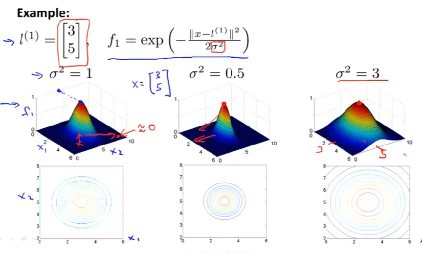

上图表现了核函数的图像化特征以及改变$\sigma$对图像的影响。

#### 如何选择标记点

**我们的思想是，将每一个样本点都设定为一个标记点。**然后计算出每一个样本点相对于其他标记点的相似度函数并形成一个向量，这个向量即为我们的特征向量，记为$f^{(i)}$

同时将我们的支持向量机于核函数结合起来得到新的优化函数：
$$
\min_\theta C\sum_{i=1}^{m}[y^{(i)}cost_1(\theta^Tf^{(i)})+(1-y^{(i)})cost_0(\theta^Tf^{(i)})]+\frac{1}{2}\sum_{j=1}^n\theta^2_j
$$

#### $C$与方差和偏差

$C=\frac{1}{\lambda}$，大的$C$对应着更低的偏差，更高的方差。小的$C$对应着更高的偏差，更低的方差。

#### $\sigma$与方差和偏差

大的$\sigma$对应着$f^{(i)}$更为平缓的变化，有着高偏差，低方差。

小的$\sigma$对应着低偏差，高方差。


### 使用SVM

使用封装的软件包来求出$\theta$

自己应该做的事情：

* 拟定$C$
* 选择核函数(如果选择高斯核函数则需要再选择$\sigma$)

线性核函数：
$$
Predict\ ''y=1''\  if\ \theta^Tx>0
$$
注意：在使用高斯核函数之前需要对特征量进行数量级的统一缩放。

#### 多分类问题

许多SVM包已经提供了关于多分类问题的函数，但是如果没有的话，我们仍然会采取之前一对多的思想，将某类单独分出来，其他的类统一归为一类，如此往复，得到一系列$\theta$。

#### 逻辑回归与SVM的选择

设$n=特征量$，$m=样本数量$

当$n$远大于$m$时，使用逻辑回归或者带有线性核函数的SVM

当$n$较小，$m$较大时，我们使用带有高斯核函数的SVM

当$n$较小，$m$极大时，我们需要创建额外的特征，然后使用逻辑回归或者无核SVM

另外，使用SVM不必担心局部最优的问题，它拟合出来的模型一定是全局最优的。
